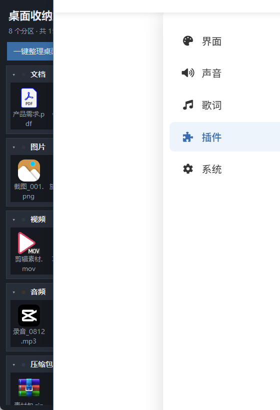
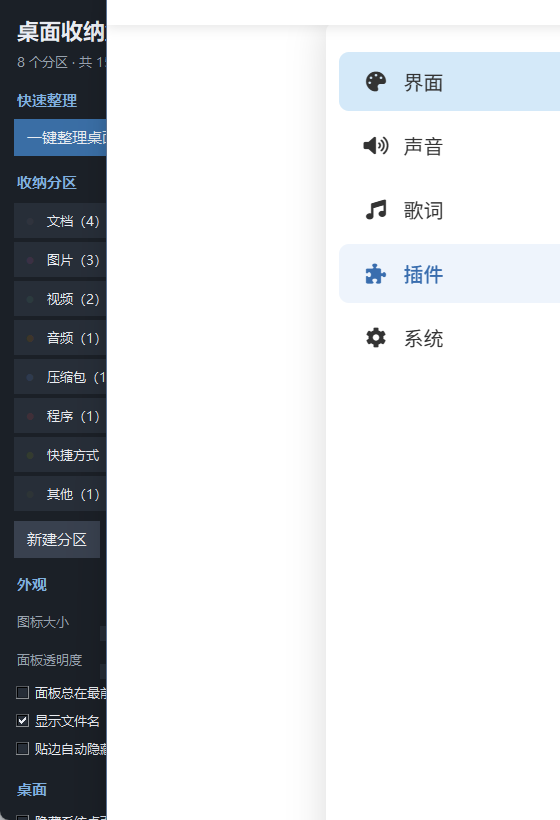

# 桌面收纳盒

一个轻量的 Windows 桌面收纳程序：**所有分区集中在同一个面板窗口里**，
不用时收进系统托盘，桌面上不留任何窗口占位。

> 作者：唐小漫 ｜ 开发工具：Codex ｜ 版本：v2.1（2026-09-12）

**English**: [README.en.md](README.en.md) — a lightweight Windows desktop organizer,
single panel, zero dependencies, tray + edge-dock, Windows 7/10/11.

只用 Python 标准库写成，不需要安装任何第三方依赖，图标是代码画出来的。

## 界面预览

主面板（所有分区都在一个窗口里）：

设置页（含「关于」信息）：

## 怎么用

1. 双击 **启动.bat**（打包过 exe 的话直接双击那个 exe）
2. 面板默认贴在屏幕右侧，里面从上到下是各个分区
3. 把桌面文件拖到某个分区上，就收进那个分区
4. 点窗口右上角 × → 默认收进系统托盘（想改成直接退出，见「设置 → 关闭按钮」）

双击 **自检.bat** 可以检查这台电脑的环境是否正常（不会动你的文件）。

## 系统兼容性

| 项目 | 支持情况 |
| --- | --- |
| Windows 11 | 完整支持（深色标题栏、圆角窗口） |
| Windows 10 | 完整支持（1809 及以上有深色标题栏） |
| Windows 7 / 8 / 8.1 | 支持，需要 Python 3.8（3.9 起官方不再支持 Win7）；深色标题栏和圆角是系统不具备的能力，会自动降级为系统默认外观，功能不受影响 |
| 32 位 / 64 位 | 都支持（句柄相关 API 会自动选择 32/64 位版本） |
| 屏幕尺寸 | 已测试 1024×728、1366×728、1536×824、1920×1040、2560×1440，面板会按所在屏幕的工作区自动调整大小，保证完整显示在屏幕内 |
| 屏幕缩放 | 100% / 125% / 150% 等都可以；程序是 DPI 感知的，文字和图标会跟随系统缩放 |
| 多显示器 | 支持：贴边、吸附、小屏适配都按"窗口所在的那块屏幕"计算，笔记本外接显示器也正常 |
| 字体 | 自动挑选系统里可用的中文字体（微软雅黑 UI → 微软雅黑 → 黑体 → Tahoma），Win7 上也正常 |

Windows 7 上要打包 exe 的话，用 `pyinstaller==5.13.2`（PyInstaller 6 起不再支持 Win7），
命令和 `打包exe.bat` 里一致，把 `python -m PyInstaller` 换成对应版本即可。

## 界面说明

面板顶部有两个页签：

- **收纳**：所有分区都在这里。每个分区一行标题（箭头 / 颜色点 / 名称 / 数量 / ⋯ ＋ 夹），
  下面就是这个分区里的文件图标。
- **设置**：一键整理、撤销、分区管理、外观、桌面图标、开机自启、收纳目录、关于。

常用操作：

| 想做什么 | 怎么做 |
| --- | --- |
| 收纳文件 | 从桌面或资源管理器把文件拖到某个分区上 |
| 自动归类 | 拖到面板顶部（标题栏/按钮那一片空白），按扩展名自动分到对应分区 |
| 换分类 | 按住分区里的文件，拖到另一个分区上放开 |
| 折叠分区 | 点分区标题那一行（或它的箭头） |
| 收拢桌面 | 点「折叠全部」，面板变成一排分区标题 |
| 贴边隐藏 | 按住「桌面收纳盒」标题往屏幕顶端拖，或点工具栏「贴边隐藏」 |
| 关闭行为 | 设置页「关闭按钮」里选：隐藏到系统托盘 / 直接退出程序 |
| 收起托盘 | 点窗口右上角 ×（选的是"隐藏到托盘"时），或点托盘图标 |
| 打开文件夹 | 点分区右侧的「夹」，或分区菜单里的「打开…文件夹」 |
| 换颜色 | 分区菜单 →「换个颜色」 |
| 调整大小 | 拖窗口边缘；图标大小在设置页里调 |
| 多选 | Ctrl + 点击；选中后按 Delete 直接进回收站 |
| 滚动 | 鼠标放在面板任意位置都能用滚轮滚；也可以拖动右侧细滚动条，或点它上下的空白翻页 |
| 刷新 | F5 |

## 系统托盘

点窗口的 × 之后，面板会收进系统托盘：

- **点关闭按钮做什么，是设置项**：「设置 → 关闭按钮」里选「隐藏到系统托盘」或「直接退出程序」，
  默认是隐藏到托盘；这个选择对窗口的最小化按钮同样生效
- **程序一启动，托盘里就有这个抽屉图标**（不需要先收起才有），鼠标悬停会显示
  「桌面收纳盒（运行中）」，收起后变成「桌面收纳盒（已收起）」
- **任务栏不会留下图标**（窗口带 TOOLWINDOW 样式，Alt+Tab 里也不会出现）
- **点托盘图标**：面板显示 / 收起来回切换
- **右键托盘图标**：显示收纳面板、一键整理桌面、撤销上次整理、设置
  - 菜单里**故意不放「退出程序」**：托盘图标在屏幕角落，菜单贴着光标弹出，
    最下面那项很容易被误点。退出统一放在「设置 → 关于 → 退出程序」，并且会先确认
  - 菜单出现在鼠标上方（不会正压在某一项上，避免随手一点就误触）
  - 菜单用的是 Tk 自己的菜单窗口，不抢前台、不跑系统级模态循环：
    真实托盘场景下资源管理器会连发几十条通知，原生菜单在那种时机容易出问题
  - 窗口过程（接收托盘通知的地方）只做"记标记"，真正处理都回到 Tk 事件循环里做，
    避免从系统模态循环重入 Tcl 导致进程硬崩
- **点窗口的最小化按钮**：同样收进托盘
- **要退出程序**：「设置 → 关于 → 退出程序」，会先弹确认框（默认是「否」）
- 资源管理器重启后，托盘图标会自动重新加载
- 如果系统托盘不可用（极少见），程序会保持窗口显示并提示，不会把窗口藏得找不回来

## 贴边自动隐藏

把面板拖到屏幕最上方（或者在工具栏点「贴边隐藏」），它就会贴住屏幕上边缘并收起来，
平时只在屏幕顶上留一条约 6 像素的细边，桌面完全空出来。

- **鼠标碰到屏幕顶边**（面板所在的那一段横向范围）→ 面板滑出来
- **鼠标移开约 0.5 秒** → 自动收回
- **想取消**：鼠标碰一下让它滑出来，把它往下拖超过 70 像素，或者在设置页取消勾选「贴边自动隐藏」
- 贴边状态下面板会强制置顶（否则会被最大化的窗口盖住，鼠标就碰不到它了）
- 贴边状态和贴边时所在的横向位置都会记住，下次启动直接就是收起状态

## 程序图标

图标是一段代码画出来的**黄色抽屉**（`dt_icon.py`）：先按 4 倍超采样绘制，再按面积平均缩小，
所以 16×16 到 256×256 都不会有明显锯齿，也没有任何外部图片依赖。

- 运行 `python dt_icon.py` 会重新生成多尺寸的 `app.ico`
- `打包exe.bat` 会自动把这个图标嵌进 exe
- 窗口左上角、任务栏（未隐藏时）和托盘都用这个图标

## 面板里的关于信息

「设置 → 关于」显示：名称与版本号、作者、开发工具、版本日期、实现方式，
并带「收起到托盘」和「退出程序」两个按钮（点关闭按钮的行为请到「设置 → 关闭按钮」里选）。
版本信息集中写在 `dt_config.py` 的 `APP_VERSION / APP_AUTHOR / APP_TOOL / APP_DATE`，
改一处即可同时更新界面、欢迎弹窗和说明文档。

## 文件说明

| 文件 | 作用 |
| --- | --- |
| `main.py` | 程序入口：配置、托盘、面板、文件操作的接线 |
| `dt_panel.py` | 单窗口收纳面板（分区、图标网格、拖入拖出、贴边隐藏） |
| `dt_control.py` | 设置页（含「关于」） |
| `dt_ui.py` | 界面公共件：配色、按钮、细滚动条、滚轮支持 |
| `dt_icon.py` | 程序图标（代码绘制 + 生成 app.ico） |
| `dt_tray.py` | 系统托盘图标与托盘菜单 |
| `dt_config.py` | 配置读写、桌面路径、默认分类规则、版本信息 |
| `dt_organize.py` | 分类判断、文件搬运、撤销记录 |
| `dt_winapi.py` | Windows 原生能力：图标提取、多显示器工作区、桌面图标开关、拖放、托盘底层 |
| `selftest.py` | 自检（在临时目录里跑，不影响真实文件） |
| `tools/ui_smoke.py` | 界面冒烟测试：分区渲染、滚轮、托盘、贴边、小屏适配 |
| `tools/` 下其余脚本 | 开发用探针：窗口位置、贴边几何、托盘消息、菜单位置、真实右键消息序列、Tk 菜单可用性 |
| `启动.bat` / `自检.bat` / `打包exe.bat` | 启动、自检、打包 |
| `app.ico` | 打包用图标，由 `python dt_icon.py` 生成（不纳入版本库） |

## 许可

MIT License，作者 唐小漫（tawahai），开发工具 Codex。详见 [LICENSE](LICENSE)。

## 文件都放在哪

- 收纳目录：`桌面\收纳盒\`（设置页里可以换成别的位置）
- 配置：`%APPDATA%\DesktopTidy\config.json`
- 整理记录：`%APPDATA%\DesktopTidy\history\`
- 出错日志：`%APPDATA%\DesktopTidy\crash.log`、托盘异常写 `tray_error.log`
- 运行日志：`%APPDATA%\DesktopTidy\tray.log`（每 30 秒一条心跳 + 每次托盘操作，
  排查"莫名退出"时看这个文件）

配置里可以自定义分类规则：`rules` 是默认规则，`custom_rules` 用来加自己的扩展名，
例如 `"设计": [".psd", ".ai", ".fig"]`（同时可以在设置页里新建同名分区）。

## 打包成 exe

双击 **打包exe.bat**，脚本会安装 PyInstaller 并生成 `dist\桌面收纳盒.exe`，
同时把 `app.ico` 作为程序图标嵌进去。生成的 exe 不依赖 Python，可以直接拷到别的电脑用。

## 说明与限制

- 程序只是把文件移动到桌面下的子文件夹，不做删除；删除操作一律走回收站
- 撤销针对「最近一次整理」的记录，更早的记录不会自动还原
- 隐藏桌面图标用的是系统自带开关，等同于右键桌面 → 查看 → 显示桌面图标
- 面板里每个分区最多显示 200 个文件（再多请点「夹」打开文件夹看）
- 贴边隐藏目前在屏幕上边缘；左侧/右侧贴边还没有做

## 卸载

1. 在设置页取消勾选「开机自动启动」
2. 托盘图标右键 → 退出程序
3. 删除本文件夹，需要的话再删掉 `%APPDATA%\DesktopTidy` 和桌面上的 `收纳盒` 文件夹
